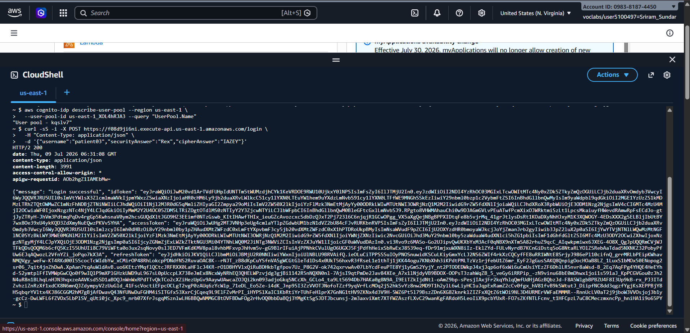
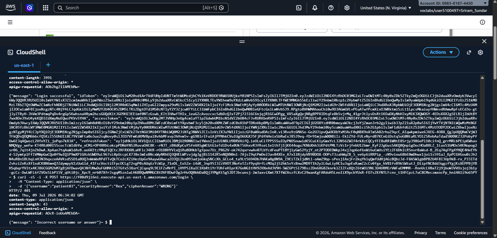
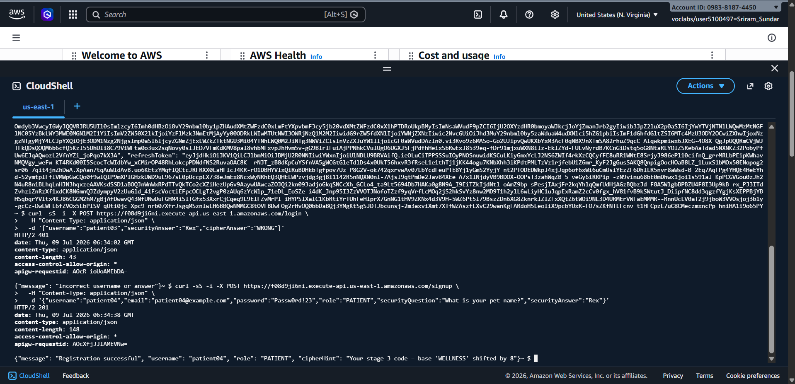
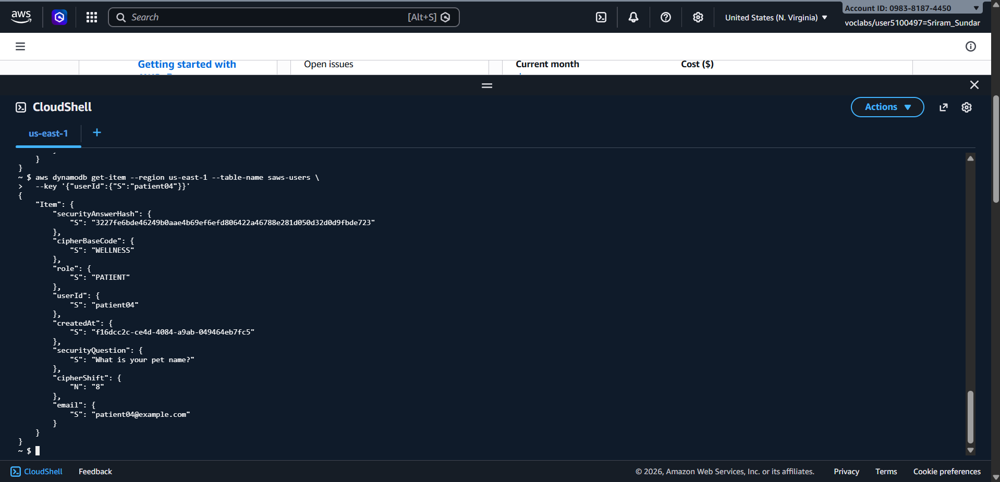
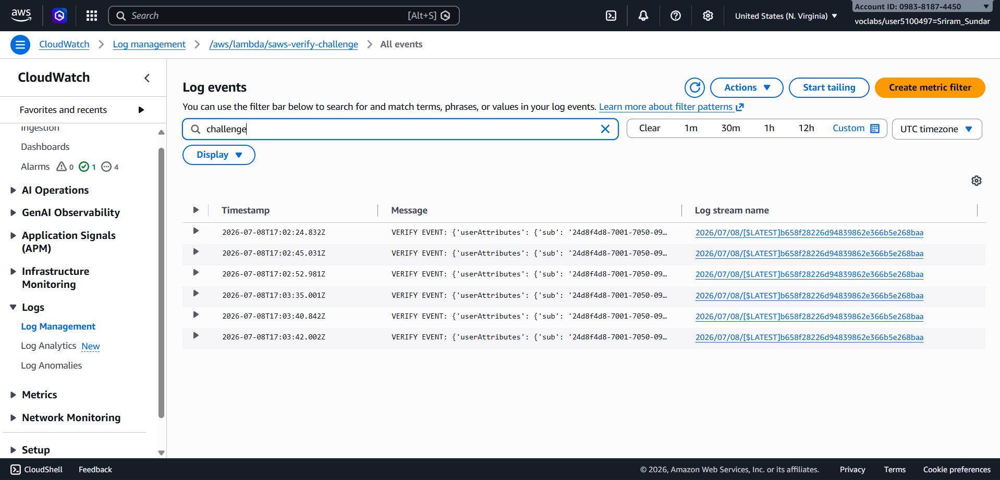
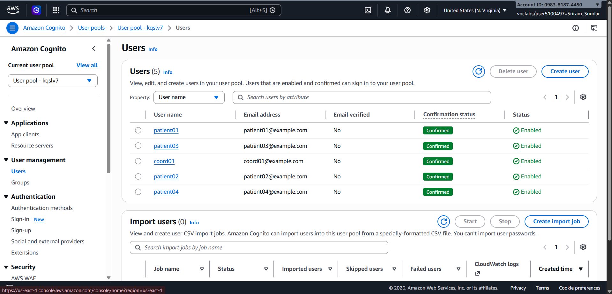

# SAWS — User Management & Authentication: Test Evidence

**Module:** User Management & Authentication (Sprint 2 — Development & Testing)
**Branch:** `authentication-build`
**Author:** Sriram Sundar
**Date:** 2026-07-09

This document maps to the five *Required Testing* categories that apply to the Authentication module: successful authentication, failed login, database integrity, API testing, and Lambda event testing. (Chatbot, queue/message, and notification-delivery testing belong to other modules.) Evidence type per the rubric: **screenshots + logs + test-case table.**

---

## 1. Environment

| Item | Value |
|---|---|
| Region | `us-east-1` |
| Cognito User Pool | `us-east-1_XOL4hRJA3` |
| App Client | `569v3tttnj2ibdr2hb6fjrkoh2` |
| DynamoDB Table | `saws-users` (partition key: `userId`) |
| API Base URL | `https://f08d9ji6ni.execute-api.us-east-1.amazonaws.com` |
| Challenge Lambdas | `saws-define-challenge`, `saws-create-challenge`, `saws-verify-challenge` |
| Test users | `patient03`, `patient04` (role: PATIENT), `coord01` (role: coordinator) |

---

## 2. Test Summary

| ID | Rubric Category | Test | Expected | Result | Evidence |
|---|---|---|---|---|---|
| TC-01 | Successful authentication | Multi-stage login (security answer + Caesar cipher) returns tokens | HTTP 200 + JWT tokens | Pass | `t4-login-success.png` |
| TC-02 | Failed login | Login with wrong cipher answer is rejected | HTTP 401 | Pass | `t6-wrong-cipher.png` |
| TC-03 | API testing | Signup over API Gateway registers a new patient | HTTP 201 | Pass | `t7-http-signup.png` |
| TC-04 | Database integrity | Registered user persisted in DynamoDB with correct attributes | Item present | Pass | `t3-dynamodb.png` |
| TC-05 | Lambda event testing | `saws-verify-challenge` logs challenge events on invocation | VERIFY EVENT in logs | Pass | `t9-verify-log.png` |
| TC-06 | Registration / user mgmt | Users created & confirmed in Cognito pool | Users Confirmed/Enabled | Pass | `t1-cognito-user.png` |

---

## 3. Detailed Test Cases

### TC-01 — Successful authentication
**Objective:** A valid patient completes the challenge-based login and receives session tokens.
**Command**
```bash
curl -sS -i -X POST https://f08d9ji6ni.execute-api.us-east-1.amazonaws.com/login \
  -H "Content-Type: application/json" \
  -d '{"username":"patient03","securityAnswer":"Rex","cipherAnswer":"IAZEY"}'
```
**Expected:** HTTP 200 with `idToken`, `accessToken`, `refreshToken`.
**Actual:** `HTTP/2 200` — `{"message": "Login successful", ...}` with all three JWTs and `expiresIn: 3600`. The decoded `idToken` carries `cognito:groups: ["PATIENT"]` and `cognito:username: patient03`, confirming role assignment and session issuance.
**Result:** Pass



---

### TC-02 — Failed login
**Objective:** An incorrect Caesar-cipher answer is rejected (negative test).
**Command**
```bash
curl -sS -i -X POST https://f08d9ji6ni.execute-api.us-east-1.amazonaws.com/login \
  -H "Content-Type: application/json" \
  -d '{"username":"patient03","securityAnswer":"Rex","cipherAnswer":"WRONG"}'
```
**Expected:** HTTP 401, no tokens issued.
**Actual:** `HTTP/2 401` — `{"message": "Incorrect username or answer"}`. No tokens returned.
**Result:** Pass



---

### TC-03 — API testing (signup endpoint)
**Objective:** The signup route on API Gateway registers a new patient end-to-end.
**Command**
```bash
curl -sS -i -X POST https://f08d9ji6ni.execute-api.us-east-1.amazonaws.com/signup \
  -H "Content-Type: application/json" \
  -d '{"username":"patient04","email":"patient04@example.com","password":"Passw0rd!23","role":"PATIENT","securityQuestion":"What is your pet name?","securityAnswer":"Rex"}'
```
**Expected:** HTTP 201 with a registration confirmation.
**Actual:** `HTTP/2 201` — `{"message": "Registration successful", "username": "patient04", "role": "PATIENT", "cipherHint": "Your stage-3 code = base 'WELLNESS' shifted by 8"}`.
**Result:** Pass
*(The `/login` calls in TC-01/TC-02 also exercise the API Gateway to Lambda path, providing additional API-testing coverage.)*



---

### TC-04 — Database integrity
**Objective:** A registered user is persisted in `saws-users` with the expected attributes and a hashed (not plaintext) security answer.
**Command**
```bash
aws dynamodb get-item --region us-east-1 --table-name saws-users \
  --key '{"userId":{"S":"patient04"}}'
```
**Expected:** Item returned with `userId`, `email`, `role`, `securityQuestion`, hashed answer, and cipher fields.
**Actual:** Item present — `userId: patient04`, `email: patient04@example.com`, `role: PATIENT`, `securityQuestion: "What is your pet name?"`, `securityAnswerHash` (SHA-256, not plaintext), `cipherBaseCode: WELLNESS`, `cipherShift: 8`. Confirms the signup Lambda writes durably to DynamoDB.
**Result:** Pass



---

### TC-05 — Lambda event testing
**Objective:** The `saws-verify-challenge` Lambda is invoked during the auth flow and logs the challenge event it processes.
**Steps:** CloudWatch to Log groups to `/aws/lambda/saws-verify-challenge`, search all streams for `challenge`.
**Expected:** VERIFY-stage invocation entries.
**Actual:** Multiple `VERIFY EVENT: {'userAttributes': {'sub': ...}}` log lines, confirming the verify-challenge Lambda receives and processes challenge events on login.
**Result:** Pass



---

### TC-06 — Registration / user management (Cognito)
**Objective:** Registered users exist in the Cognito user pool in a usable state.
**Steps:** Cognito to User pools to `us-east-1_XOL4hRJA3` to Users.
**Expected:** Registered users listed as Confirmed and Enabled.
**Actual:** 5 users (`patient01`–`patient04`, `coord01`) all **Confirmed / Enabled**, including the `patient04` created in TC-03.
**Result:** Pass



---

## 4. Notes & Follow-ups

These are honest observations for the Sprint 2 report's "technical challenges / design decisions" discussion — none block the tests above, but they're worth tracking:

1. **Stage-1 (UserID/Password) enforcement.** The requirement specifies three sequential stages, the first being UserID/Password via Cognito. The tested `/login` request supplies `securityAnswer` and `cipherAnswer` (stages 2–3) and returns tokens without a password field. Confirm in `saws-define-challenge` whether the password stage is enforced elsewhere in the flow; if not, this is a gap to close before final submission.
2. **`createdAt` field value.** The DynamoDB item stores a UUID string in `createdAt` rather than a timestamp — likely a swapped variable in the signup Lambda. Cosmetic (doesn't affect auth), quick one-line fix.
3. **Verify-log timestamps.** The VERIFY EVENT entries captured are from a prior login session; functionally identical, but for a tidy submission you may re-run one login and capture a same-day log line.

---

## 5. Traceability to Rubric

| Required Testing category | Covered by |
|---|---|
| Successful authentication testing | TC-01 (+ TC-06) |
| Failed login testing | TC-02 |
| Database integrity testing | TC-04 |
| API testing | TC-03 (+ TC-01/02) |
| Lambda/Cloud Function event testing | TC-05 |

*Chatbot utterance, queue/message, and notification-delivery testing are out of scope for this module.*
