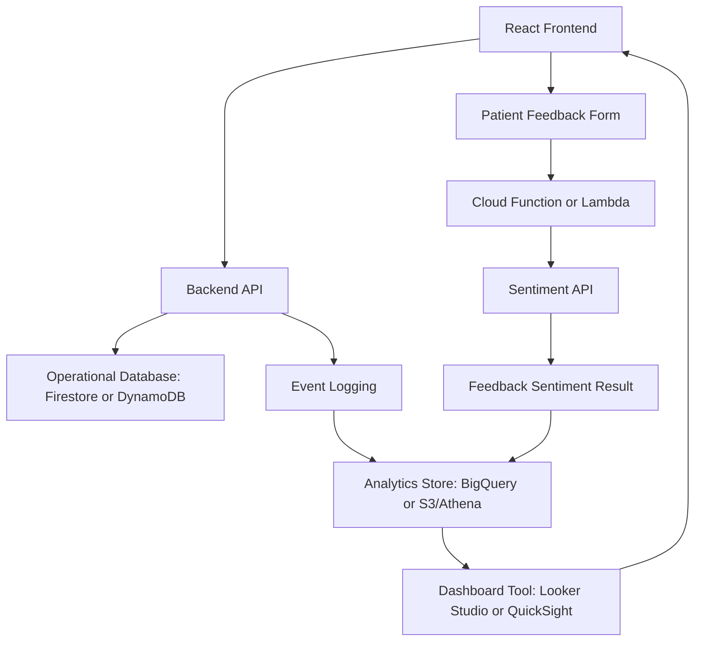
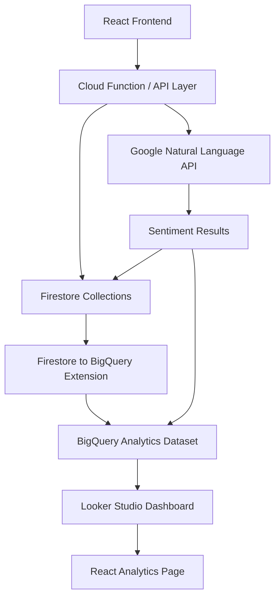
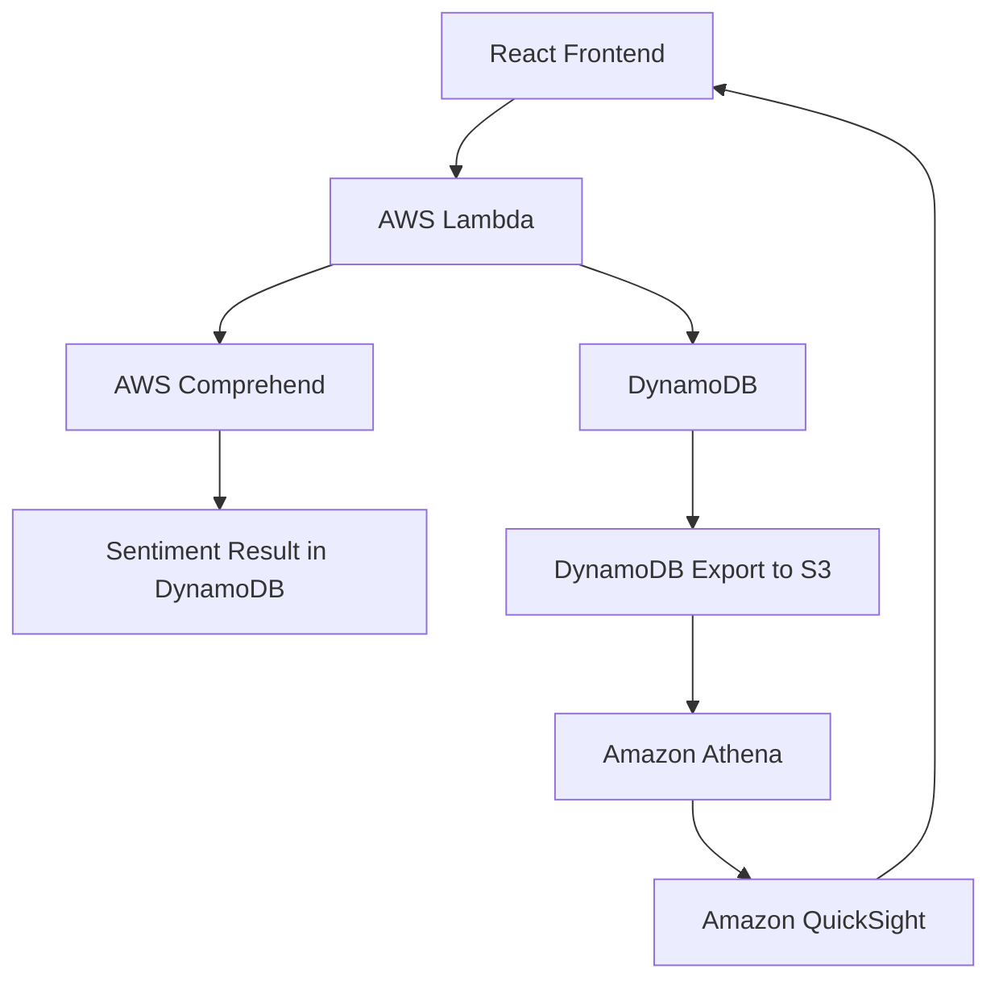
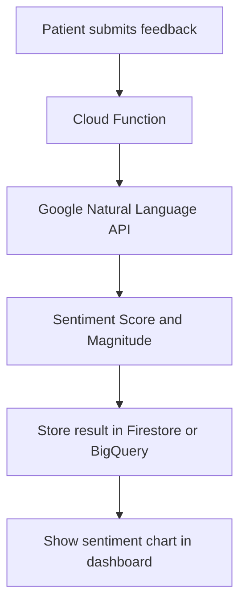
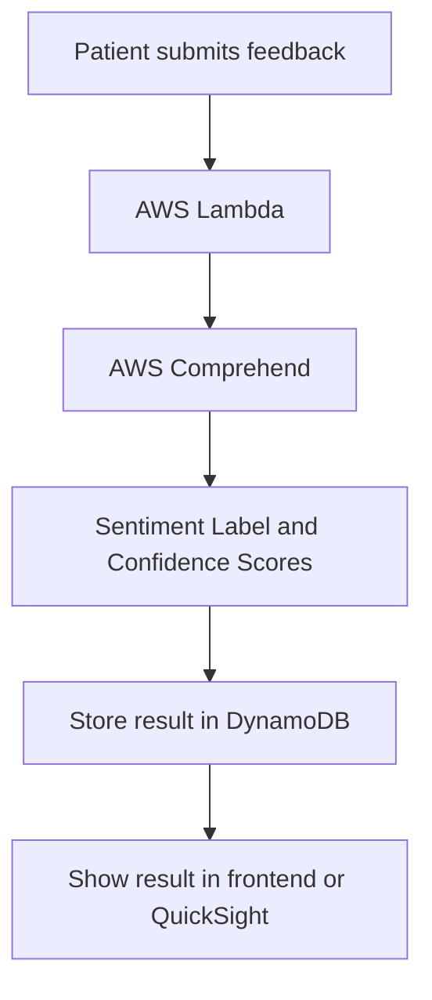

# SAWS Analytics Research - Sprint 1

**Project:** SmartCare Appointment and Wellness System (SAWS)  
**Course:** CSCI 5410/S26  
**Sprint:** Sprint 1 - Planning Phase  
**Module:** Data Analysis and Visualization  
**Prepared for:** Analytics Research Work Item

## Purpose

This folder contains Sprint 1 research and planning notes for the SAWS analytics module. The goal of this module is to convert raw system activity into useful insights for patients, guest users, and wellness coordinators.

The project specification requires the analytics module to support platform usage analytics, patient engagement monitoring, feedback analysis, sentiment analysis, and dashboard visualizations. This Sprint 1 work focuses on planning the data requirements, dashboard design, service choices, and integration approach before implementation begins.

## Documents Included

| File | Purpose |
|---|---|
| `analytics-requirements.md` | Defines what the analytics module must show and which data is needed. |
| `analytics-service-comparison.md` | Compares Looker Studio vs QuickSight and AWS Comprehend vs Google Natural Language API. |
| `analytics-data-model.md` | Proposes collections/tables needed for analytics. |
| `analytics-architecture-draft.md` | Shows the proposed analytics pipeline and serverless architecture. |
| `sentiment-api-research.md` | Explains how feedback sentiment analysis will work. |
| `dashboard-wireframe-notes.md` | Describes dashboard cards, charts, and tables. |
| `sprint1-report-section-analytics.md` | Draft text that can be used in the Sprint 1 group report after team review. |
| `gitlab-work-item-description.md` | Suggested GitLab issue description for the Analytics Research work item. |

## Recommended Sprint 1 Decision

For Sprint 1 planning, the recommended analytics stack is:

```text
Firestore / application event data
        ↓
BigQuery analytics store
        ↓
Looker Studio dashboard
        ↓
React frontend embeds or links dashboard views
```

For sentiment analysis, the recommended primary option is:

```text
Patient feedback form
        ↓
Cloud Function or Lambda
        ↓
Google Natural Language API OR AWS Comprehend
        ↓
Store sentiment result with feedback record
        ↓
Show sentiment summary in frontend/dashboard
```

The final selection should match the team's actual storage and backend choices. If most feedback data is stored in Firestore, Google Natural Language API and Looker Studio are easier to connect. If most feedback data is stored in DynamoDB and AWS Lambda, AWS Comprehend and QuickSight are more AWS-native.

---

# Analytics Architecture Draft

## 1. Purpose

This document describes the proposed analytics architecture for the SAWS project. The goal is to use serverless and managed cloud services to collect events, process feedback sentiment, store analytics data, and show dashboards.

## 2. High-Level Architecture



## 3. Recommended Primary Architecture

The recommended Sprint 1 analytics architecture is:



## 4. Step-by-Step Data Flow

### Step 1: User action happens

A patient logs in, books an appointment, or submits feedback from the React frontend.

### Step 2: Backend stores operational data

The backend saves data into Firestore or DynamoDB, depending on the module.

Examples:

- User profile
- Login event
- Appointment record
- Service feedback

### Step 3: Feedback sentiment is processed

When a patient submits feedback, a serverless function sends the feedback comment to a sentiment API.

Possible services:

- Google Natural Language API
- AWS Comprehend

### Step 4: Sentiment result is stored

The backend stores the sentiment result with the feedback record.

Example:

```json
{
  "feedbackId": "fb_001",
  "sentimentLabel": "POSITIVE",
  "sentimentScore": 0.92
}
```

### Step 5: Data is prepared for dashboard

Analytics data is sent or exported into an analytics-friendly store.

Primary recommendation:

```text
Firestore → BigQuery → Looker Studio
```

AWS alternative:

```text
DynamoDB → S3 → Athena → QuickSight
```

### Step 6: Dashboard is displayed

The frontend shows dashboard output to users based on their role.

- Guests: public aggregated analytics
- Patients: public analytics and personal appointment/feedback summary
- Coordinators: full operational analytics

## 5. Why Use a Separate Analytics Store?

Operational databases are designed for application transactions. Analytics dashboards often need aggregations such as counts, trends, and group-by calculations.

Using a separate analytics store helps because:

- Dashboard queries are easier.
- Operational database performance is protected.
- Charts can be built from cleaned and summarized data.
- Future analytics can be added without changing the core app too much.

## 6. AWS Alternative Architecture

If the team chooses AWS for analytics, the architecture can be:



## 7. Why Not Build Charts Fully Manually in React?

The team could build charts directly in React using libraries like Chart.js or Recharts, but that should not be the main analytics plan for this project.

Reasons:

- The project specification specifically mentions Looker Studio and/or QuickSight.
- Dashboard tools reduce custom frontend work.
- BI tools make it easier to create tables, filters, and charts quickly.
- The analytics module becomes more cloud-focused, which matches the course objective.

React can still be used to display dashboard embeds, links, or summarized API results.

## 8. Proposed Role-Based Analytics Access

| User Type | Analytics Access |
|---|---|
| Guest | Public service popularity, overall rating, general sentiment summary |
| Registered Patient | Public analytics plus personal appointment and feedback summary |
| Coordinator | Full dashboard: patients, logins, appointments, service popularity, feedback, sentiment |

## 9. Sprint 1 Deliverables from This Architecture

For Sprint 1, this architecture can support:

- Preliminary architecture diagram
- Service justification
- Data model planning
- Dashboard wireframe planning
- API investigation notes
- GitLab issue updates and commits

---

# Analytics Data Model Research

## 1. Purpose

The analytics module needs clean data from multiple SAWS modules. This document proposes the minimum data structures needed to calculate dashboard metrics and sentiment summaries.

This is a planning document for Sprint 1. The final implementation can use Firestore collections, DynamoDB tables, or a BigQuery analytics dataset depending on the team's selected architecture.

## 2. Design Idea

Operational data and analytics data should be separated logically.

- Operational data is used by the live application.
- Analytics data is used for dashboards, charts, and reports.

Example:

```text
Operational collections/tables:
users, appointments, services, feedback

Analytics/events collections/tables:
user_events, appointment_events, feedback_sentiment, dashboard_summary
```

## 3. Users Collection / Table

Stores basic user profile information.

```json
{
  "userId": "user_123",
  "role": "PATIENT",
  "fullName": "Example Patient",
  "email": "patient@example.com",
  "createdAt": "2026-06-09T10:00:00Z",
  "status": "ACTIVE"
}
```

### Analytics Supported

- Total registered patients
- Number of users by role
- Registration trend over time

## 4. User Events Collection / Table

Stores important user actions such as login success, login failure, and registration.

```json
{
  "eventId": "evt_001",
  "userId": "user_123",
  "role": "PATIENT",
  "eventType": "LOGIN_SUCCESS",
  "timestamp": "2026-06-09T10:30:00Z",
  "source": "COGNITO_OR_CUSTOM_AUTH_FLOW"
}
```

### Possible Event Types

- `REGISTRATION_SUCCESS`
- `LOGIN_SUCCESS`
- `LOGIN_FAILURE`
- `LOGOUT`
- `MFA_STAGE_2_SUCCESS`
- `MFA_STAGE_3_SUCCESS`

### Analytics Supported

- Login statistics
- Failed login trends
- Active user engagement
- Role-based activity

## 5. Services Collection / Table

Stores healthcare and wellness service information.

```json
{
  "serviceId": "srv_001",
  "serviceName": "Mental Wellness Session",
  "category": "Wellness",
  "price": 50.00,
  "status": "ACTIVE",
  "createdAt": "2026-06-09T09:00:00Z"
}
```

### Analytics Supported

- Popular wellness services
- Service category distribution
- Service pricing overview

## 6. Appointments Collection / Table

Stores appointment booking records.

```json
{
  "appointmentId": "apt_001",
  "patientId": "user_123",
  "serviceId": "srv_001",
  "doctorId": "doc_001",
  "appointmentDate": "2026-06-15",
  "appointmentTime": "14:00",
  "status": "CONFIRMED",
  "createdAt": "2026-06-09T11:00:00Z",
  "updatedAt": "2026-06-09T11:10:00Z"
}
```

### Possible Status Values

- `PENDING`
- `CONFIRMED`
- `CANCELLED`
- `COMPLETED`
- `REJECTED`

### Analytics Supported

- Appointment trends
- Appointment status summary
- Popular service calculation
- Coordinator approval/rejection patterns

## 7. Feedback Collection / Table

Stores structured patient feedback.

```json
{
  "feedbackId": "fb_001",
  "patientId": "user_123",
  "serviceId": "srv_001",
  "appointmentId": "apt_001",
  "rating": 5,
  "comment": "The session was helpful and easy to book.",
  "submittedAt": "2026-06-16T18:00:00Z"
}
```

### Analytics Supported

- Feedback table
- Average rating
- Rating trend
- Feedback count by service

## 8. Feedback Sentiment Collection / Table

Stores sentiment analysis results after the feedback comment is processed.

```json
{
  "sentimentId": "sent_001",
  "feedbackId": "fb_001",
  "serviceId": "srv_001",
  "sentimentLabel": "POSITIVE",
  "sentimentScore": 0.92,
  "sentimentMagnitude": 0.80,
  "processedAt": "2026-06-16T18:01:00Z",
  "provider": "GOOGLE_NATURAL_LANGUAGE_API"
}
```

### Possible Sentiment Labels

- `POSITIVE`
- `NEUTRAL`
- `NEGATIVE`
- `MIXED`

### Analytics Supported

- Sentiment distribution chart
- Negative feedback count
- Service satisfaction comparison
- Feedback quality monitoring

## 9. Dashboard Summary Table / View

A summarized table or BigQuery view can make dashboard queries easier.

Example fields:

```json
{
  "summaryDate": "2026-06-16",
  "totalPatients": 120,
  "dailyLogins": 45,
  "appointmentsCreated": 18,
  "appointmentsConfirmed": 12,
  "appointmentsCancelled": 3,
  "positiveFeedbackCount": 10,
  "neutralFeedbackCount": 2,
  "negativeFeedbackCount": 1
}
```

### Why Summary Data Helps

Dashboards should load quickly. Instead of recalculating everything from raw records every time, the team can create summary views or scheduled queries.

## 10. Privacy Notes

The analytics dashboard must avoid exposing sensitive patient details.

Recommended rules:

- Guests see only public aggregated data.
- Patients see public aggregated data and their own personal information.
- Coordinators see internal analytics but still should not expose unnecessary personal information.
- Feedback comments shown in coordinator tables should avoid displaying unnecessary private health details.

## 11. Minimum Data Needed for Sprint 2 Prototype

For a simple prototype, the team only needs sample records for:

- 5 to 10 users
- 5 services
- 20 appointments
- 10 feedback records
- Sentiment labels for feedback records

This is enough to build charts and show that the analytics design works.

---

# Analytics Requirements Research

## 1. Module Goal

The analytics module helps SAWS convert application data into meaningful insights. Instead of only storing users, appointments, services, and feedback, the system should summarize this data so users and coordinators can understand platform activity.

In simple words:

> The analytics module answers: How many people are using the system, which services are popular, how appointments are changing over time, and whether patients are happy with the service.

## 2. Required Analytics from Project Specification

The SAWS project specification requires the analytics and visualization module to support:

- Total registered patients
- Login statistics
- Appointment trends
- Popular wellness services
- Feedback table
- Charts for appointment statistics
- Service popularity visualization
- Feedback sentiment analysis
- Sentiment results displayed in the frontend

## 3. Intended Users

### Guest Users

Guests should see general, non-sensitive analytics only.

Examples:

- Overall feedback summary
- General sentiment summary
- Popular public wellness services
- Public service ratings

Guests must not see private patient information, appointment history, or internal coordinator metrics.

### Registered Patients

Patients should see general analytics and their own personal activity.

Examples:

- Their own appointment history summary
- Their own feedback submissions
- General service popularity
- General sentiment score for services

Patients must not see other patients' private data.

### Wellness Coordinators

Coordinators should see operational analytics because they manage the platform.

Examples:

- Total registered patients
- Login activity
- Appointment trend by date
- Appointment status counts
- Popular doctors or services
- Feedback table
- Sentiment distribution
- Ratings by service

## 4. Key Metrics

| Metric | Meaning | Why It Matters | User Visibility |
|---|---|---|---|
| Total registered patients | Count of users with patient role | Shows platform adoption | Coordinator |
| Daily/weekly login count | Number of successful logins over time | Shows user engagement | Coordinator |
| Appointment trend | Number of appointments by date/week/month | Helps coordinators prepare capacity | Coordinator |
| Appointment status count | Pending, confirmed, cancelled, completed | Helps track workflow health | Coordinator |
| Popular wellness services | Services with the highest booking count | Helps improve service planning | All users, aggregated only |
| Average rating | Average patient score from feedback | Shows service satisfaction | All users, aggregated only |
| Sentiment distribution | Positive, neutral, negative feedback counts | Shows patient experience quickly | All users, aggregated only |
| Feedback table | List of feedback with sentiment results | Helps coordinators review issues | Coordinator |

## 5. Data Needed from Other Modules

### Authentication Module

Data needed:

- User ID
- Role: guest, patient, coordinator
- Registration timestamp
- Login timestamp
- Login success/failure status

Analytics supported:

- Total registered patients
- Login statistics
- Role-based usage

### Appointment Module

Data needed:

- Appointment ID
- Patient ID
- Service ID
- Doctor/specialist ID
- Appointment date and time
- Appointment status
- Created timestamp

Analytics supported:

- Appointment trends
- Appointment status charts
- Peak booking periods
- Popular services

### Service Management Module

Data needed:

- Service ID
- Service name
- Service category
- Price
- Availability status

Analytics supported:

- Popular wellness services
- Service category demand
- Service price overview

### Feedback Module

Data needed:

- Feedback ID
- Patient ID
- Service ID
- Rating
- Comment
- Submitted timestamp
- Sentiment label
- Sentiment score

Analytics supported:

- Feedback table
- Sentiment summary
- Average rating
- Negative feedback detection

## 6. Analytics Requirements for Sprint 1

Sprint 1 does not require full implementation. For this module, Sprint 1 should produce:

- Analytics requirements list
- Proposed data model
- Initial dashboard layout
- Cloud service comparison
- Sentiment API research
- Initial architecture draft
- GitLab work item updates and commits

## 7. Non-Functional Requirements

### Privacy

Patient-specific data must not be shown to guests or other patients. Public dashboards should use aggregated data only.

### Security

Analytics API endpoints should use role-based access control. Coordinators can access internal analytics. Guests and patients should access only public or personal analytics.

### Scalability

The analytics pipeline should be serverless so the team does not manage analytics servers manually.

### Maintainability

Analytics data should be stored in a structured format so dashboards can be extended later.

### Cost Awareness

Because this is a student project, the design should avoid unnecessary paid or complex enterprise features where a simpler dashboard can satisfy the requirement.

---

# Analytics Service Comparison and Justification

## 1. Purpose

The project specification allows the analytics dashboard to use either Looker Studio or Amazon QuickSight. It also allows sentiment analysis using either AWS Comprehend or Google Natural Language API.

This document compares the possible choices and explains the recommended option for Sprint 1 planning.

## 2. Dashboard Tool Comparison

| Criteria | Looker Studio | Amazon QuickSight |
|---|---|---|
| Cloud provider | Google | AWS |
| Best fit | BigQuery, Google Sheets, Google Cloud data sources | AWS data sources such as S3, Athena, RDS, Redshift, QuickSight datasets |
| Student project complexity | Easier to create and share basic dashboards | More powerful but embedding and permissions can be more complex |
| Frontend integration | Can be shared or embedded depending on access settings | Supports embedded dashboards and visuals through QuickSight embedding options |
| Data warehouse fit | Strong fit with BigQuery | Strong fit with S3/Athena/Redshift/RDS pipelines |
| Recommended when | Analytics data is stored in Firestore/BigQuery | Analytics data is stored mainly in AWS services |

## 3. Recommended Dashboard Choice

### Recommended: Looker Studio with BigQuery

Looker Studio is recommended for the Sprint 1 analytics plan because it is simple for dashboard creation, easy to connect with BigQuery, and suitable for showing charts such as appointment trends, service popularity, and sentiment summaries.

Suggested flow:

```text
Firestore / application events
        ↓
BigQuery
        ↓
Looker Studio
        ↓
React frontend dashboard page
```

## 4. Why Use Looker Studio?

### Reason 1: Good fit for BigQuery

Looker Studio has a direct BigQuery connector. This makes it easier to visualize analytics tables, views, or custom SQL results from BigQuery.

### Reason 2: Simple for Sprint 1 and student project scope

For Sprint 1, the goal is planning and research. Looker Studio lets the team design dashboard concepts quickly without spending too much time managing BI infrastructure.

### Reason 3: Useful for multi-cloud design

The project is a multi-cloud serverless application. Since other modules may use GCP Pub/Sub, Firestore, or Cloud Functions, Looker Studio and BigQuery keep the analytics part naturally aligned with the GCP side.

### Reason 4: Dashboard requirements are not extremely complex

The required visuals are feedback tables, appointment charts, and service popularity charts. These are standard BI dashboard features and do not require heavy custom analytics engineering.

## 5. Why Not QuickSight as the Primary Option?

QuickSight is still a valid option, but it is not the primary recommendation for Sprint 1 planning.

Reasons:

- It is more AWS-native, so it is strongest when analytics data is already in AWS services such as S3, Athena, or Redshift.
- Dashboard embedding and access permissions may require more setup than the team needs during Sprint 1.
- If the analytics data is stored in Firestore or BigQuery, using QuickSight may add extra cross-cloud movement.

QuickSight should be selected if the team decides that feedback, appointments, and analytics exports will be stored mainly on AWS.

## 6. Sentiment Tool Comparison

| Criteria | Google Natural Language API | AWS Comprehend |
|---|---|---|
| Cloud provider | Google Cloud | AWS |
| Main operation | `documents.analyzeSentiment` | Sentiment detection through Comprehend sentiment APIs |
| Output style | Sentiment score and magnitude | Sentiment label and confidence scores |
| Best fit | Cloud Functions, Firestore, BigQuery, Looker Studio | Lambda, DynamoDB, S3, QuickSight |
| Recommended when | Feedback pipeline is GCP-centered | Feedback pipeline is AWS-centered |

## 7. Recommended Sentiment Choice

### Recommended Primary Option: Google Natural Language API

Google Natural Language API is recommended if the team uses Firestore/BigQuery for analytics because the sentiment result can be stored with the feedback record and visualized easily in Looker Studio.

Suggested flow:

```text
Feedback submitted
        ↓
Cloud Function
        ↓
Google Natural Language API
        ↓
Store sentiment score/label
        ↓
BigQuery and Looker Studio visualization
```

## 8. Why Use Google Natural Language API?

### Reason 1: Aligns with Looker Studio + BigQuery

If Looker Studio and BigQuery are used for dashboards, Google Natural Language API keeps the analytics pipeline on the same cloud side.

### Reason 2: Useful numeric output

The API returns sentiment information that can be converted into positive, neutral, or negative categories and used for charts.

### Reason 3: Serverless-friendly

It can be called from a Cloud Function when a patient submits feedback.

## 9. Why Not AWS Comprehend as the Primary Option?

AWS Comprehend is a strong option and may actually be better if the feedback module is implemented with AWS Lambda and DynamoDB.

It is not the primary recommendation here only because the proposed analytics dashboard is Looker Studio + BigQuery. If the data is already in GCP, using Google Natural Language API avoids unnecessary cross-cloud API calls.

## 10. Final Decision Matrix

| Team Direction | Recommended Dashboard | Recommended Sentiment API |
|---|---|---|
| Firestore + Cloud Functions + BigQuery | Looker Studio | Google Natural Language API |
| DynamoDB + Lambda + S3/Athena | QuickSight | AWS Comprehend |
| Mixed-cloud with GCP analytics | Looker Studio | Google Natural Language API |
| Mixed-cloud with AWS analytics | QuickSight | AWS Comprehend |

## 11. Sprint 1 Recommendation Statement

For Sprint 1, the analytics module should propose **Looker Studio + BigQuery + Google Natural Language API** as the primary analytics design because it is simple, serverless-friendly, suitable for dashboarding, and aligns well with a GCP analytics pipeline. However, the team should keep **QuickSight + AWS Comprehend** as the AWS-native alternative if the final data storage decision becomes DynamoDB/S3/Athena.

---

# Dashboard Wireframe Notes

## 1. Purpose

This document defines the planned analytics dashboard for SAWS. It helps the team understand what charts, tables, and summary cards should be visible in the frontend.

## 2. Dashboard Users

The dashboard should show different information based on user role.

| User Type | Dashboard Scope |
|---|---|
| Guest | Public and aggregated analytics only |
| Registered Patient | Public analytics plus own appointment/feedback summary |
| Wellness Coordinator | Full operational analytics |

## 3. Coordinator Dashboard Layout

The coordinator dashboard is the most important analytics view because coordinators manage platform activity.

Suggested layout:

```text
+------------------------------------------------------+
| SAWS Coordinator Analytics Dashboard                 |
+------------------------------------------------------+
| Total Patients | Today's Logins | Appointments Today |
+------------------------------------------------------+
| Appointment Trend Line Chart                         |
+------------------------------------------------------+
| Popular Services Bar Chart | Sentiment Donut Chart   |
+------------------------------------------------------+
| Appointment Status Chart | Average Rating by Service |
+------------------------------------------------------+
| Feedback Table                                       |
+------------------------------------------------------+
```

## 4. Dashboard Components

### A. KPI Cards

KPI cards show important numbers quickly.

Recommended cards:

- Total registered patients
- Total appointments
- Pending appointments
- Confirmed appointments
- Today's logins
- Average feedback rating
- Positive sentiment percentage

### B. Appointment Trend Chart

Chart type:

- Line chart
- X-axis: date/week/month
- Y-axis: number of appointments

Purpose:

- Shows whether appointment demand is increasing or decreasing.
- Helps coordinators plan capacity.

### C. Appointment Status Chart

Chart type:

- Bar chart or donut chart

Categories:

- Pending
- Confirmed
- Cancelled
- Completed
- Rejected

Purpose:

- Shows the operational health of appointment processing.
- Helps coordinators identify pending workload.

### D. Popular Services Chart

Chart type:

- Bar chart

X-axis:

- Service name

Y-axis:

- Number of bookings

Purpose:

- Shows which healthcare or wellness services are most demanded.
- Helps coordinators manage schedules and promotional packages.

### E. Sentiment Summary Chart

Chart type:

- Donut chart or stacked bar chart

Categories:

- Positive
- Neutral
- Negative
- Mixed, if supported

Purpose:

- Shows overall patient satisfaction.
- Helps coordinators quickly identify service quality issues.

### F. Feedback Table

Columns:

- Feedback ID
- Service name
- Rating
- Comment preview
- Sentiment label
- Sentiment score
- Submitted date

Purpose:

- Lets coordinators review actual patient feedback.
- Helps identify negative experiences that may need follow-up.

## 5. Guest Dashboard Layout

Guests should only see safe, aggregated information.

Suggested layout:

```text
+-----------------------------------------------+
| Public Service Insights                        |
+-----------------------------------------------+
| Most Popular Services                          |
+-----------------------------------------------+
| Overall Feedback Summary                       |
+-----------------------------------------------+
| General Sentiment Summary                      |
+-----------------------------------------------+
```

Guests should not see:

- Patient names
- Patient emails
- Appointment history
- Internal coordinator performance
- Raw private feedback with personal details

## 6. Patient Dashboard Layout

Patients should see general analytics and their own activity.

Suggested layout:

```text
+-----------------------------------------------+
| My Wellness Activity                           |
+-----------------------------------------------+
| My Appointments | My Feedback Count            |
+-----------------------------------------------+
| My Appointment Status Summary                  |
+-----------------------------------------------+
| Public Service Popularity                      |
+-----------------------------------------------+
| Overall Feedback Sentiment                     |
+-----------------------------------------------+
```

Patients should not see other patients' private information.

## 7. Suggested Dashboard Filters

For the coordinator dashboard:

- Date range
- Service category
- Appointment status
- Sentiment label
- Doctor/specialist

For public dashboards:

- Service category
- Date range, if aggregated

## 8. Sample Chart-to-Data Mapping

| Dashboard Element | Data Source | Aggregation |
|---|---|---|
| Total registered patients | Users | Count users where role = PATIENT |
| Login statistics | UserEvents | Count LOGIN_SUCCESS by date |
| Appointment trend | Appointments | Count appointments by date |
| Popular services | Appointments + Services | Count appointments by service |
| Average rating | Feedback | Average rating by service |
| Sentiment summary | FeedbackSentiment | Count by sentiment label |
| Feedback table | Feedback + Sentiment | Join feedback and sentiment result |

## 9. Sprint 2 Prototype Target

For Sprint 2, the team can create a simple prototype dashboard using sample data.

Minimum prototype visuals:

- Total patients card
- Appointment trend chart
- Popular services chart
- Sentiment summary chart
- Feedback table

This would be enough to prove that the analytics design is working.

---

# Sentiment API Research

## 1. Purpose

The SAWS project requires patient feedback to be analyzed automatically using a cloud sentiment analysis service. The sentiment result should be displayed in the frontend.

Sentiment analysis means automatically detecting whether a text comment sounds positive, neutral, negative, or mixed.

Example:

```text
Feedback: "The appointment booking was quick and the coordinator was helpful."
Sentiment: POSITIVE
```

## 2. Why Sentiment Analysis Is Useful in SAWS

Patients may submit feedback after healthcare consultations or wellness sessions. Coordinators may not have time to read every comment immediately. Sentiment analysis helps the system quickly identify the general mood of feedback.

Usefulness:

- Quickly identify unhappy patients
- Summarize patient satisfaction
- Compare services by feedback quality
- Show overall platform sentiment to users
- Help coordinators improve service quality

## 3. Option 1: Google Natural Language API

Google Natural Language API can analyze sentiment in a document using the `documents.analyzeSentiment` method.

### Expected Flow



### Example Stored Result

```json
{
  "feedbackId": "fb_001",
  "comment": "The session was very helpful.",
  "sentimentLabel": "POSITIVE",
  "sentimentScore": 0.92,
  "sentimentMagnitude": 0.80,
  "provider": "GOOGLE_NATURAL_LANGUAGE_API"
}
```

### Why Use It?

- Good fit if the analytics pipeline uses Firestore, BigQuery, and Looker Studio.
- Easy to call from Cloud Functions.
- Numeric sentiment scores are useful for charts.
- Fits the GCP side of the multi-cloud architecture.

### Why Not Use It?

- If the feedback module is fully implemented using AWS Lambda and DynamoDB, calling a GCP API creates cross-cloud complexity.
- The team must manage Google Cloud API credentials and billing setup.

## 4. Option 2: AWS Comprehend

AWS Comprehend can analyze text and return sentiment information.

### Expected Flow



### Example Stored Result

```json
{
  "feedbackId": "fb_001",
  "comment": "The wait time was too long.",
  "sentimentLabel": "NEGATIVE",
  "positiveScore": 0.05,
  "neutralScore": 0.10,
  "negativeScore": 0.83,
  "mixedScore": 0.02,
  "provider": "AWS_COMPREHEND"
}
```

### Why Use It?

- Good fit if the backend uses AWS Lambda and DynamoDB.
- Sentiment labels are easy to understand.
- Fits well with an AWS-native analytics route such as DynamoDB, S3, Athena, and QuickSight.

### Why Not Use It?

- If the dashboard uses BigQuery and Looker Studio, sentiment results may need extra movement from AWS to GCP.
- The project may become more complex if feedback storage is already in Firestore.

## 5. Recommended Sentiment Design

The recommended design depends on where the team stores feedback.

| Feedback Storage | Recommended Sentiment API | Reason |
|---|---|---|
| Firestore | Google Natural Language API | Same cloud side as Firestore and BigQuery |
| DynamoDB | AWS Comprehend | Same cloud side as Lambda and DynamoDB |
| BigQuery analytics pipeline | Google Natural Language API | Easy to visualize in Looker Studio |
| QuickSight analytics pipeline | AWS Comprehend | AWS-native integration path |

## 6. Sprint 1 Recommendation

For Sprint 1 planning, use **Google Natural Language API** as the primary proposed sentiment service if the team chooses **Looker Studio + BigQuery** for analytics. Keep **AWS Comprehend** as an alternative if the team decides to keep the feedback pipeline on AWS.

## 7. Sentiment Label Mapping

If using Google Natural Language API, the team may need to convert numeric scores into labels.

Suggested mapping:

| Sentiment Score | Label |
|---|---|
| Greater than 0.25 | POSITIVE |
| Between -0.25 and 0.25 | NEUTRAL |
| Less than -0.25 | NEGATIVE |

This mapping can be adjusted after testing with sample feedback.

## 8. Example Test Feedback for Sprint 2

| Feedback Comment | Expected Sentiment |
|---|---|
| The doctor was very helpful and the booking was easy. | Positive |
| The appointment was okay but the waiting time was long. | Neutral or Mixed |
| The system was confusing and my appointment was delayed. | Negative |
| The wellness package was excellent and affordable. | Positive |
| I could not find my appointment details easily. | Negative |

---

## References

- Amazon QuickSight embedded analytics: https://docs.aws.amazon.com/quick/latest/userguide/embedded-analytics.html
- Amazon QuickSight dashboard embedding: https://docs.aws.amazon.com/quick/latest/userguide/embedding-dashboards.html
- Amazon Comprehend sentiment analysis: https://docs.aws.amazon.com/comprehend/latest/dg/how-sentiment.html
- Google Looker Studio BigQuery connector: https://docs.cloud.google.com/data-studio/connect-to-google-bigquery
- Google Cloud Natural Language API sentiment analysis: https://docs.cloud.google.com/natural-language/docs/analyzing-sentiment
- Google Natural Language API `documents.analyzeSentiment`: https://docs.cloud.google.com/natural-language/docs/reference/rest/v1/documents/analyzeSentiment
- Firestore to BigQuery integration: https://firebase.google.com/docs/firestore/solutions/bigquery
- Stream Firestore to BigQuery extension: https://extensions.dev/extensions/firebase/firestore-bigquery-export
- BigQuery overview: https://docs.cloud.google.com/bigquery/docs/introduction
- DynamoDB export to S3: https://docs.aws.amazon.com/amazondynamodb/latest/developerguide/S3DataExport.HowItWorks.html
