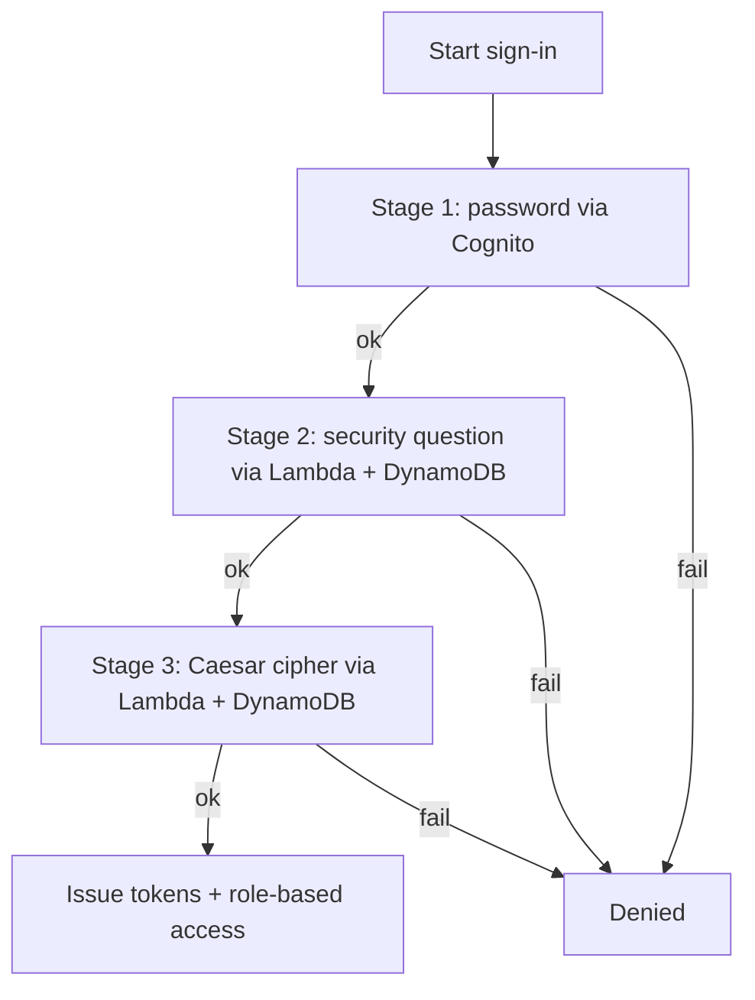
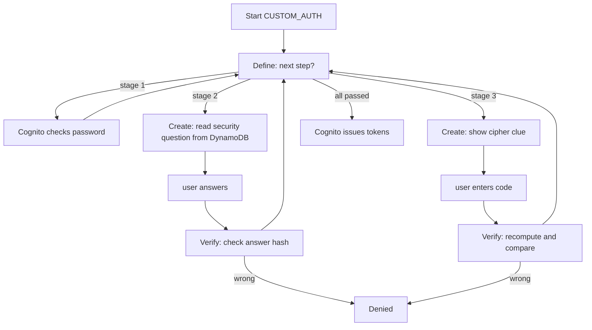

# SAWS Authentication Research - Sprint 1

**Project:** SmartCare Appointment and Wellness System (SAWS)  
**Course:** CSCI 5410/S26  
**Sprint:** Sprint 1 - Planning Phase  
**Module:** User Management and Authentication  
**Prepared for:** Authentication Research Work Item

## Purpose

This folder contains Sprint 1 research and planning notes for the SAWS authentication module. The goal of this module is to control who can enter the system and what they are allowed to do, using a sequential three-stage login and role-based access.

The project specification requires this module to support registration validation, a three-stage multi-factor login (password, security question, Caesar-cipher healthcare code), session management, and role-based access for guests, registered patients, and wellness coordinators. This Sprint 1 work focuses on planning the architecture, data model, service choices, and the custom login flow before implementation begins.

## Documents Included

| File | Purpose |
|---|---|
| `auth-requirements-research.md` | Defines what the authentication module must do and which data each stage needs. |
| `auth-service-comparison.md` | Compares Cognito vs custom auth vs Firebase, and justifies the AWS choice. |
| `auth-data-model.md` | Proposes the Cognito attributes and the DynamoDB `users` table. |
| `auth-architecture-draft.md` | Shows the registration flow, the 3-stage login, and the serverless architecture. |
| `cognito-custom-auth-flow-research.md` | Deep dive on the Cognito custom-challenge Lambda triggers that chain the three stages. |
| `caesar-cipher-design.md` | Proposes the concrete Caesar-cipher scheme for Stage 3 (the one open design decision). |
| `sprint1-report-section-authentication.md` | Draft text for the Sprint 1 group report after team review. |
| `gitlab-work-item-description.md` | Suggested GitLab issue description for the Authentication Research work item. |

## Recommended Sprint 1 Decision

For Sprint 1 planning, the recommended authentication stack is:

```text
React frontend
        -> sign in
Amazon Cognito user pool (Stage 1: user ID + password)
        -> custom auth challenge Lambda triggers
Stage 2: Lambda + DynamoDB (security question / answer)
Stage 3: Lambda + DynamoDB (Caesar-cipher healthcare code)
        -> all stages pass
Cognito issues JWT tokens (ID / access / refresh)
        -> API Gateway Cognito authorizer enforces role on every protected call
```

The three login stages are chained using Cognito's custom authentication challenge triggers (`DefineAuthChallenge`, `CreateAuthChallenge`, `VerifyAuthChallengeResponse`), so Stages 2 and 3 plug into Cognito as the "Lambda + DynamoDB" the specification names, rather than being a separate hand-built system.

This module is pinned to AWS because the specification names AWS services for every stage. A Firebase Auth + Cloud Functions + Firestore design is documented as the alternative if the team direction changes and the TA approves.

---

# Authentication - architecture draft (Sprint 1)

This is the proposed design for how login actually works. The goal was to use managed AWS services so we're not building password security or token handling ourselves.

## The approach

The tricky part is that the spec wants three login stages, but a normal Cognito login only checks a password. The way to add steps after the password is Cognito's custom authentication challenge flow, which is driven by three Lambda triggers. That's what lets stages 2 and 3 be real "Lambda + DynamoDB" stages like the spec says, instead of something bolted on the side.

So the plan is:

```text
React app
   -> Cognito (stage 1: user ID + password)
   -> custom challenge -> Lambda + DynamoDB (stage 2: security question)
   -> custom challenge -> Lambda + DynamoDB (stage 3: Caesar cipher)
   -> all three pass -> Cognito issues JWT tokens
   -> API Gateway checks the token + role on protected calls
```

## Registration flow

1. User fills the sign-up form; the frontend validates the inputs.
2. Cognito creates the user (ID + password).
3. We write the rest to the DynamoDB users table - role, security question, a hash of the answer, the cipher base code + shift, timestamps.
4. Hand off to notifications to send a "registered successfully" message.

## Login flow (the three stages)



Stage 1 is Cognito checking the password. Stage 2, a Lambda reads the user's security question from DynamoDB, shows it, and checks the answer against the stored hash. Stage 3, a Lambda shows the cipher clue and checks the entered code. When all three pass, Cognito hands back tokens and we send the "logged in" notification.

## Sessions and roles

Cognito gives back JWTs after login (ID, access, refresh). The frontend keeps these and sends the access token on each call. API Gateway uses a Cognito authorizer to check the token before any protected Lambda runs. For roles we'll either use Cognito groups (`patient`, `coordinator`) or a role attribute, and check it before coordinator-only actions. (Need to decide groups vs attribute - leaning groups.)

## Security notes

Don't store the password, security answer, or cipher value in plain text. Give the Lambdas least-privilege IAM (only the DynamoDB access they need). Don't reveal which stage failed. Keep token expiry short-ish.

## If we ever moved to GCP

Not the plan, since the spec names AWS here, but the mapping is close: Firebase Auth ~ Cognito, Cloud Functions ~ Lambda triggers, Firestore ~ DynamoDB. Documented as a fallback only.

---

# Authentication - data model notes (Sprint 1)

The idea is to split credentials from everything else. Cognito owns the password - we never see it or store it. Everything our own Lambdas need for stages 2 and 3 goes in a DynamoDB users table.

## What Cognito holds (stage 1)

The user ID and password (hashed and managed by Cognito), email, and group membership for the role. We don't model this ourselves; it's the managed half.

## The users table in DynamoDB

One item per user, keyed by the Cognito user ID. This is what the stage 2 and 3 Lambdas read.

```json
{
  "userId": "sub_abc123",
  "role": "PATIENT",
  "fullName": "Example Patient",
  "email": "patient@example.com",
  "securityQuestion": "What is your favourite clinic?",
  "securityAnswerHash": "<sha256 of the lowercased answer>",
  "cipherBaseCode": "HEALTH",
  "cipherShift": 3,
  "createdAt": "2026-06-10T14:30:00Z",
  "lastLoginAt": null
}
```

Why these fields: `role` drives access control. `securityQuestion` is shown at stage 2 and the answer is checked against `securityAnswerHash` (we store the hash, never the plain answer). `cipherBaseCode` is the clue shown at stage 3 and `cipherShift` is the user's secret. The two timestamps are there so analytics can count registrations and logins later without us building a separate thing.

Roles are just `PATIENT` or `COORDINATOR`. Guests aren't in this table because they don't register.

## Storing the cipher secret

Two options, and we should pick one:

- Store the shift (recommended) - recompute the expected code at login and compare. Simple.
- Store only a hash of the expected code and drop the shift - a bit more secure but less flexible.

Going with storing the shift for now unless the team wants otherwise.

## Sessions

We probably don't need a sessions table. Cognito's tokens already prove an active session until they expire. We'd only add a sessions table if we wanted to force-log-out users or keep an audit log of logins - decide later.

## Privacy

A user should only read their own record; a coordinator only when there's an actual admin reason. The security answer hash and cipher fields are never read by any client - only the Lambdas touch them, and those run with least-privilege IAM.

## Sample data for the Sprint 2 prototype

2 patients (different questions and shifts) and 1 coordinator is enough to demo registration, all three login stages, a role-gated coordinator action, and a failed login.

---

# Authentication - requirements notes (Sprint 1)

Our module is the login and access-control part of SAWS. It covers sign-up, the multi-stage login, keeping a user signed in, and deciding what each type of user is allowed to do. Pretty much every other module needs a user ID and a role from us before it can do anything, so we treated this as a foundation piece during planning.

## What the spec asks for

The spec is specific about the login: it has to be three stages, in order.

- Stage 1 - user ID and password, using AWS Cognito
- Stage 2 - a security question/answer, using Lambda + DynamoDB
- Stage 3 - a "healthcare code" using a Caesar cipher, using Lambda + DynamoDB

On top of that it wants registration validation, secure login, session management, and role-based access. User details go in DynamoDB. All three stages name AWS services, so unlike the messaging module (which is GCP), auth stays on AWS.

## The three user types

Only patients and coordinators actually log in. Guests don't.

| Role | Logs in? | Can do |
|---|---|---|
| Guest | No | Browse services, use the chatbot, see public feedback |
| Patient | Yes (all 3 stages) | Book appointments, see history, submit concerns/feedback, chat |
| Coordinator | Yes (all 3 stages) | Everything a patient can, plus manage services, approve appointments, see analytics |

The difference between patient and coordinator is the role, not the login steps - both go through the same three stages.

## Main requirements

- User can register, with the sign-up data validated (unique ID, password rules, security question, healthcare code).
- All three stages must pass, in order, before anyone gets in.
- After stage 3, the user gets a session so they don't repeat all three stages on every request.
- A role is attached to each user and checked before coordinator-only actions.
- Registration and login should trigger a notification (handed off to the notifications module).
- Password, security answer, and the cipher value must not be stored as plain text.

## How it connects to the other modules

Messaging and the chatbot need the logged-in user's ID and role from us (guests can't submit concerns). The notifications module is what actually sends the "you registered / you logged in" messages - we just trigger it. Analytics wants our registration and login events to count things like total patients and login stats, so we should record those with timestamps.

## Non-functional stuff

Keep it serverless (Cognito + Lambda + DynamoDB) so there's no auth server to run, and it scales on its own. Don't leak which stage failed in error messages. One patient must never be able to read another patient's record. All three services have free tiers that are fine for our scale.

## What we're handing in for Sprint 1

The requirements (this), an architecture draft, the data model, the service comparison/justification, a short write-up on the Cognito custom-challenge flow, and the Caesar cipher design - all committed under `docs/authentication/`, plus the issue/commit activity on GitLab.

---

# Authentication - service choices and why (Sprint 1)

The spec names AWS services for every login stage, so this module is on AWS. This is the reasoning behind the choices, plus the alternatives we looked at.

## Stage 1 - identity / password

We're using Cognito. We did consider rolling our own (own DB + password hashing) and Firebase Auth on the GCP side. Building our own is the worst option - we'd be responsible for password hashing, tokens, and lockout, which is exactly the security-critical code you don't want to get wrong as students. Firebase Auth is fine but it's the wrong cloud for this module. Cognito wins because it's named in the spec, it handles the hard security parts for us, and it supports the custom challenge flow we need for the extra stages.

## Stages 2 and 3 - the extra checks

These run on Lambda + DynamoDB, which is also what the spec names. The important reason is that the security answer and the cipher secret have to be checked on the server, not in the browser - otherwise anyone could read the answer in the page. Lambda reading DynamoDB keeps the secrets server-side, and it plugs straight into the Cognito challenge flow.

## So the recommended stack is

```text
Stage 1: Cognito (password)
Stage 2: Lambda + DynamoDB (security question)
Stage 3: Lambda + DynamoDB (Caesar cipher)
-> Cognito issues JWTs -> API Gateway authorizer checks token + role
```

Roles via Cognito groups (`patient`, `coordinator`) or a role attribute.

## Why AWS and not GCP for this module

Mostly because the spec names AWS for every stage, and Cognito's custom challenges fit the three-stage requirement almost perfectly. It also keeps the project genuinely multi-cloud - auth and notifications are AWS, messaging is GCP. Firebase Auth + Cloud Functions + Firestore is the equivalent if the team ever switched, but that would need TA sign-off.

Since notifications are also AWS, there's no cross-cloud call inside our module - we just hand off to the AWS notifications module. That keeps the security-sensitive path on one cloud.

## Quick comparison table

| | AWS (recommended) | GCP alternative |
|---|---|---|
| Stage 1 | Cognito | Firebase Auth |
| Stages 2 & 3 | Lambda custom challenges | Cloud Functions |
| Database | DynamoDB | Firestore |

---

# Caesar cipher (stage 3) - design notes

The spec just says "healthcare code clue using Caesar cipher" and leaves the actual scheme to us, so this is the proposed design. Open to changing it with the team.

A Caesar cipher shifts every letter by a fixed amount and wraps around at Z. Example with shift 3: HEALTH -> KHDOWK (H->K, E->H, A->D, L->O, T->W, H->K).

## The plan

At registration each user gets:
- a base code - a short healthcare word shown as the clue (HEALTH, CARE, WELLNESS, etc.)
- a secret shift N (1-25) that only they're told to remember

At stage 3, the system shows the base code ("enter the code for: HEALTH"), the user applies their shift and types the result, and the Lambda recomputes `caesar(baseCode, N)` from DynamoDB and compares. So the actual secret is the shift; the base code is just the visible prompt.

Stored in the users table as `cipherBaseCode` and `cipherShift`. (Could instead store just a hash of the expected answer and drop the shift - slightly more secure, less flexible. Going with storing the shift for now.)

## Rules to keep it consistent

- Uppercase everything before comparing, so the input's case doesn't matter.
- Only shift A-Z; leave any digits/spaces as-is.
- Wrap around (Z + 1 = A).
- Shift is 1-25 (0 or 26 would do nothing).

## Logic (pseudocode)

```text
caesar(text, shift):
    for each letter in uppercase(text):
        if A-Z: shift it, wrapping at Z
        else: leave it
verify(input, baseCode, shift):
    return uppercase(input) == caesar(baseCode, shift)
```

## Test cases for Sprint 2

| Base | Shift | Correct | Input | Result |
|---|---|---|---|---|
| HEALTH | 3 | KHDOWK | KHDOWK | pass |
| HEALTH | 3 | KHDOWK | khdowk | pass (case) |
| HEALTH | 3 | KHDOWK | HEALTH | fail (no shift) |
| CARE | 5 | HFWJ | HFWJ | pass |
| CARE | 5 | HFWJ | HFWI | fail |

That covers the happy path, case handling, and failures, which is enough for the "successful auth" and "failed login" tests the spec wants.

## Security reality

A shift only has 25 possibilities, so this is weak on its own - it's a third factor on top of the password and security question, not real protection by itself. Don't show the right answer on failure, and consider locking after a few wrong tries.

---

# Cognito custom auth flow - notes

The spec wants three login stages but a normal Cognito login only checks the password. The way to add the other two stages is Cognito's custom authentication challenge flow, which runs through three Lambda triggers. This is the part of the module I had to research most, so notes here.

## The three triggers

- `DefineAuthChallenge` - the controller. After each step it decides what comes next, or that the user has passed (issue tokens) or failed.
- `CreateAuthChallenge` - builds the current challenge. For us it reads the security question or the cipher clue from DynamoDB and presents it.
- `VerifyAuthChallengeResponse` - checks the user's answer against what's stored, returns correct/incorrect.

So for SAWS the controller sequences it as: password -> security question -> Caesar cipher -> done.

## How a login goes



The key thing is the answers and cipher secrets stay in the Lambda's private challenge parameters and in DynamoDB - the browser never sees them. At the end Cognito still gives normal JWT tokens, so sessions and the API Gateway authorizer work like usual.

## Rough idea of what Create returns (stage 2)

```json
{
  "publicChallengeParameters": { "question": "What is your favourite clinic?" },
  "privateChallengeParameters": { "expectedHash": "<hash>" },
  "challengeMetadata": "SECURITY_QA"
}
```

Verify then just returns `{ "answerCorrect": true }` or false.

## Things to watch in Sprint 2

- The stage ordering lives in `DefineAuthChallenge` - a bug there could skip a stage, so it needs careful testing (pass and fail cases for each stage).
- The Lambdas need a least-privilege IAM role - read access to the users table only.
- The frontend has to use the `CUSTOM_AUTH` flow and loop `respondToAuthChallenge` for each stage (Amplify or the Cognito SDK).
- This is the main risk in the module, so prototype it early.

---

# Sprint 1 Report Section - Authentication Module

*Draft text for the Sprint 1 group report. Review and trim with the team before submitting; the full report is capped at 4 pages, so this section may need to be shortened to roughly half a page.*

## Module Overview

The User Management and Authentication module controls access to SAWS. It handles registration, a sequential three-stage login, session management, and role-based access for the three user types: guests (no login), registered patients, and wellness coordinators. Every other module depends on a trusted user identity and role from this module, so its design was treated as foundational during Sprint 1 planning.

## Problem Statement and Scope

The module must let patients and coordinators prove their identity through three separate checks before gaining access, while keeping guests limited to public, read-only features. The Sprint 1 scope was to research the required services, design the login flow and data model, and resolve the one undefined requirement (the Caesar-cipher stage), without building the implementation yet.

## Selected Services and Justification

The specification names AWS services for every authentication stage, so the module is pinned to AWS. The proposed stack is Amazon Cognito for the password stage, AWS Lambda and Amazon DynamoDB for the security-question and Caesar-cipher stages, and Amazon API Gateway with a Cognito authorizer for protecting backend calls. Cognito was chosen because it manages the security-critical work (password hashing, token issuance, account protection) and, importantly, supports a custom authentication challenge flow that is purpose-built for chaining extra login steps after the password. A Firebase Auth, Cloud Functions, and Firestore design was documented as the alternative if the team direction changes and the TA approves.

## Proposed Architecture

Login uses Cognito's custom authentication challenge triggers (`DefineAuthChallenge`, `CreateAuthChallenge`, `VerifyAuthChallengeResponse`). Stage 1 verifies the user ID and password natively in Cognito. Stage 2 presents a security question and verifies the answer through Lambda against a hash in DynamoDB. Stage 3 presents a healthcare code clue and verifies a Caesar-cipher response through Lambda against DynamoDB. When all three stages pass, Cognito issues JWT tokens, and role-based access is enforced at API Gateway using Cognito groups or a role attribute. This design means Stages 2 and 3 are genuine "Lambda + DynamoDB" stages as the specification requires, wired into the managed Cognito flow rather than built separately.

## Data Model

User credentials live in the Cognito user pool. A DynamoDB `users` table, keyed by the Cognito user ID, holds the role, the security question and a hash of its answer, the Caesar-cipher base code and shift, basic profile fields, and registration and login timestamps. The timestamps are included so the analytics module can later count registrations and logins without a separate model. Sensitive fields (password, security answer, cipher value) are never stored in plain text.

## Caesar-Cipher Design Decision

Because the specification left the cipher scheme undefined, the module proposes assigning each user a visible base code and a secret shift at registration. At Stage 3 the system shows the base code, the user enters the shifted result, and Lambda recomputes and compares the expected value. Test cases covering the correct answer, case handling, and failure modes were prepared for Sprint 2.

## Integration with Other Modules

This module provides the user ID and role consumed by the messaging, chatbot, and analytics modules, and it hands off to the Notifications module to send registration and login confirmations. Guests are unauthenticated and cannot submit concerns or feedback.

## Sprint 1 Outcome

Sprint 1 produced the requirements list, architecture draft, data model, service justification, a deep-dive on the Cognito custom-challenge flow, and the Caesar-cipher design, all committed to GitLab under `docs/authentication/`, plus the issue/commit activity. The main technical risk identified is the custom-challenge sequencing logic, which is targeted for an early Sprint 2 prototype with per-stage test cases.

---

## References

- Amazon Cognito Developer Guide: https://docs.aws.amazon.com/cognito/latest/developerguide/what-is-amazon-cognito.html
- Cognito custom authentication challenge Lambda triggers: https://docs.aws.amazon.com/cognito/latest/developerguide/user-pool-lambda-challenge.html
- Cognito user pool Lambda trigger reference: https://docs.aws.amazon.com/cognito/latest/developerguide/cognito-user-identity-pools-working-with-aws-lambda-triggers.html
- AWS Lambda Developer Guide: https://docs.aws.amazon.com/lambda/latest/dg/welcome.html
- Amazon DynamoDB Developer Guide: https://docs.aws.amazon.com/amazondynamodb/latest/developerguide/Introduction.html
- Amazon API Gateway + Cognito authorizers: https://docs.aws.amazon.com/apigateway/latest/developerguide/apigateway-integrate-with-cognito.html
- (Alternative) Firebase Authentication: https://firebase.google.com/docs/auth
- Define / Create / Verify trigger pages under the same developer guide.
